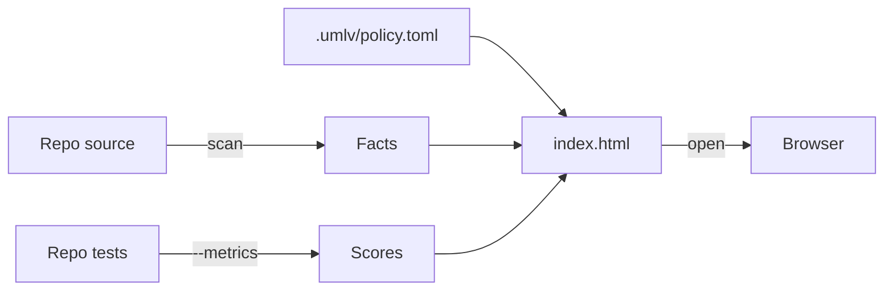

# uml-viewer-neo: design

`umlv` reads a code repository and writes one HTML page that shows its
structure: which files and folders exist, which import which, and how risky
each one is to change. You open the page in a browser, double-click into
folders, and click a box to see its functions and their scores.

It replaces [uml-viewer-polyglot](../../../uml-viewer-polyglot), a fork of
unclebob's [uml-viewer](https://github.com/unclebob/uml-viewer). The ideas
(folders as nested components, CRAP and mutation scores painted on the
diagram) come from there. What changes is the machinery: the fork needs Java
and draws with Quil, and its picture is hard to read. Upstream has no
licence, so this repo stays private.

## Goals

Version 1 is done when it can replace the fork for everyday reading of
Go, TypeScript and Python repos:

- One Go binary. Nothing else to install beyond the scanned repo's own
  toolchain (`go`, `node` or `python3`).
- One self-contained HTML file per scan that works offline and can be sent
  to someone.
- Drill-down by folder, merged arrows, a card per file with its functions and
  scores.
- `--metrics` runs the repo's tests with coverage and lights the **C** lamp
  on every box.
- A declutter control and arrow hover, because arrow spaghetti was the
  fork's worst readability problem.
- A calm 1970s mission-control look (see [Look](#look)).
- `umlv` holds itself to its own numbers: run on its own repo, its Go code
  grades green.

**Not in version 1:** `--mutate` (the **M** lamp stays unlit), red
rule-breaking arrows, proposals, repos that mix languages, Rust, live
rescanning. See [Later](#later).

## Shape



The Go side **gathers facts**: which files exist, their functions, what they
import, and each function's scores. The page **builds views**: it folds
files into folders for the level you are looking at, merges parallel arrows,
grades the lamps, lays the boxes out and draws them.

Folding happens in the page, not in Go, because drill-down is interactive.
The page needs the whole tree to open any folder without asking anything
else. That keeps the Go side small and makes the page the only place that
knows what a "view" is.

There is no server. A page opened from disk cannot read other files, so the
facts are embedded in the page itself. The one thing a server would add is
live rescanning; instead you re-run `umlv` and refresh, and the page keeps
your place (see [The page](#the-page)).

## Decisions

| Decision | Choice | Why |
|---|---|---|
| Language | Go | One static binary; no JVM. |
| Output | One HTML file with facts, code, styles and fonts inside | Works offline, survives being emailed, needs no server. |
| Layout | [ELK.js](https://github.com/kieler/elkjs) (layered), vendored | A mature layout and arrow-routing library replaces ~1,400 lines of hand-written layout in the fork. |
| Page code | Plain JavaScript modules, bundled into the page by esbuild's Go API at run time | No npm, no build step, no generated files to go stale. The modules stay importable by tests. |
| Page tests | Node's built-in `node --test` | Node is already needed for TypeScript scans; no test framework to install. |
| Drawing | Render functions return SVG markup strings | Testable in Node without a browser DOM. |
| Config | `.umlv/policy.toml`, written once, then yours | TOML allows comments and hand editing. A clean break from the fork's EDN; the fork's `.uml-viewer/` is left alone. |
| Where output goes | `.umlv/` in the scanned repo | One folder to ignore: `policy.toml`, `index.html`, `raw/` reports. |
| Source links | Editor URL scheme (`vscode://file/…:line`), editor chosen in policy | Opens the function in your editor from a static page. |

## Contracts

Two boundaries matter. Everything else is internal to one side.

### Scan facts: scanner to CLI

Every scanner produces the same JSON document: a list of modules, each with
its path, its imports and its functions. That shape is the seam for adding a
language; nothing downstream knows which scanner produced it.

| Language | A box is | Scanned by | Runs as |
|---|---|---|---|
| Go | a package (directory) | `go list` for packages and imports, `go/parser` for functions | inside the binary |
| TypeScript / JavaScript | a module (`index.*` stands for its directory) | TypeScript's own parser and module resolver | `node tsscan.js`, embedded in the binary |
| Python | a module (`__init__.py` stands for its package) | Python's `ast` | `python3 pyscan.py`, embedded in the binary |

Rules every scanner follows:

- **Imports** resolve to a project module, a library (by its real name, such
  as `github.com/spf13/pflag` or `@scope/pkg`), or the standard library.
  Type-only imports count.
- **Functions** include methods and object-literal methods, named
  `Type.method` or `object.method`. Each carries its line range, the line
  its body starts on, and its complexity.
- **Complexity (CC)** is 1 plus one per branch point: `if`, conditional
  expression, loop, `case`, `catch`/`except`, `&&`, `||`, `??`.
- Tests, vendored code and build output are skipped.

The TypeScript scanner uses the repo's own `typescript` when present, and
otherwise installs one copy into `~/.cache/umlv/ts` on first use.

### Page data: CLI to page

The CLI embeds one JSON document in the page. It carries a schema version,
the repo name, when and at which commit it was scanned, the modules with
their functions and per-function scores, the imports, the libraries, and the
parts of the policy the page needs. One Go type owns this shape, and one page
module (`model`) is its only reader.

### Policy

`umlv` writes `.umlv/policy.toml` on the first scan and never overwrites it.

| Key | Meaning | Default |
|---|---|---|
| `libraries` | Outside libraries drawn as ovals | The 8 imported by the most modules |
| `order` | Order of the top-level boxes | Alphabetical |
| `hide_arrows` | Arrows to leave out, as `[from, to]` pairs | None |
| `editor` | Editor for source links: `vscode` or `cursor` | `vscode` |
| `coverage.command`, `coverage.report` | Replace the default test command and report path | Per language, below |

## Metrics

**CRAP** measures how risky a function is to change:
`CC² × (1 − coverage)³ + CC`. A fully tested function scores its CC; an
untested complex one scores far higher.

**Coverage** counts only lines inside a function's body. A `def` line, or
the `const f =` of an arrow function, runs at import and would credit a
function nobody called. Two edge cases the fork got wrong:

| Case | Treated as |
|---|---|
| The file is absent from the coverage report | Not measured (lamp unlit), not 100% covered |
| The function has no statements to cover | Covered |

A file's functions are summarised as mean (μ), spread (σ) and worst (max).
The **C** lamp reads μ + σ, so one very bad function darkens a file whose
average looks fine.

| Lamp | C: μ + σ of CRAP | M: mutants killed (version 2) |
|---|---|---|
| Green | 8 or less | over 90% |
| Amber | over 8, up to 12 | over 80%, up to 90% |
| Red | over 12 | 80% or less |
| Unlit | nothing measured | nothing measured |

A folder's lamp shows the worst **measured** file under it and is unlit
only when nothing under it was measured, so an unmeasured file never passes
for a bad one. The folder's card also says how many of its files were
measured ("6 of 9 measured"), so an unmeasured file cannot hide either.

Coverage runs the repo's own tools; a policy entry replaces the command.

| Language | Default command | Report read |
|---|---|---|
| Go | `go test ./... -coverpkg=./... -coverprofile` | Go cover profile |
| Python | `uv run --with pytest-cov pytest --cov` | coverage.py JSON |
| TypeScript | `npx vitest run --coverage` or `npx jest --coverage` | istanbul `coverage-final.json` |

## The page

The page shows one folder level at a time. Each child file or folder is a
box; imports between them are merged into one arrow per pair of boxes.
Imports that leave the current folder become small tabs on the box (above:
who uses it from outside; below: what it uses outside). Libraries listed in
the policy are ovals.

| Action | Result |
|---|---|
| Double-click a folder | Open it |
| Esc, or click the breadcrumb | Go up a level |
| Click a box | Highlight its arrows; show its card in the side panel |
| Hover an arrow | Show which box it goes from and to |
| Declutter control | Cycle the modes below |
| Scroll, drag, pinch | Zoom and pan |

| Declutter mode | Shows |
|---|---|
| Full | Boxes with their function lists, arrows, tabs |
| Arrows | Boxes with names only, arrows |
| Boxes | Boxes with names only, no arrows |
| Triangles | No arrows; each box shows an incoming and an outgoing triangle with counts |

The **card** for a file shows its path (a link that opens it in your
editor), its CRAP μ, max and σ, and a table of functions with CRAP, CC and
coverage. The card for a folder shows its lamps, how many files were
measured, and its children. Both list what the box uses and what uses it.

The current folder and declutter mode live in the URL fragment, so
refreshing after a re-scan keeps your place.

## Look

A 1970s mission-control console, tuned for long reading rather than
nostalgia: warm and dim, no glow or scanlines.

| Token | Role |
|---|---|
| Charcoal | Page background |
| Panel | Box and side-panel fill, one step lighter |
| Rule | Thin 1px lines: box borders, arrows, table rules |
| Cream | Body text, box names |
| Amber | Labels, headings, the selected box |
| Lamp green, amber, red | Grades |
| Lamp unlit | A dark lamp with a faint ring: not measured |

- One monospaced family, IBM Plex Mono (OFL), embedded in two weights.
- Boxes are neutral panels. The lamps carry the grade and a box's border
  takes the colour of its worse lamp; whole-box colour fills made the fork's
  canvas murky.
- Colour is never the only signal: each lamp is lettered, the three lit
  states differ in brightness, and hovering a lamp shows its number.

## Code organisation

```
cmd/umlv/              flags and orchestration; the only package that wires others
internal/facts/        the scan-facts and page-data types; shared vocabulary
internal/scan/         language detection, scanner registry, helper runner
internal/scan/golang/  the Go scanner
internal/scan/helpers/ tsscan.js and pyscan.py, embedded
internal/metrics/      coverage runners, report readers, CRAP
internal/policy/       read, default and write policy.toml
internal/page/         build page data, bundle the web code, write index.html
web/                   model, layout, render, card and app modules; style.css;
                       vendored ELK.js and fonts
testdata/              small sample repos per language; captured real reports
```

Dependencies point one way: `cmd/umlv` uses everything, and every other
package depends only on `facts` and the standard library (plus TOML in
`policy` and esbuild in `page`). Scanners know nothing about metrics or the
page. The page's JavaScript modules follow the same rule inward:

| Module | Job | Depends on |
|---|---|---|
| `model` | Page data and a folder path in, a view out: boxes, merged arrows, tabs, lamps | nothing |
| `layout` | A view in, positions and arrow routes out, via ELK.js | ELK.js |
| `render` | Positions in, SVG markup out | nothing |
| `card` | A box in, side-panel markup out | nothing |
| `app` | Events, state, the URL fragment; calls the others | all of the above |

## Errors

The rule is: stop when the picture would be wrong, carry on with unlit lamps
when it would only be incomplete.

| Situation | Behaviour |
|---|---|
| The repo's toolchain (`go`, `node`, `python3`) is missing | Stop; name the tool and how to install it |
| No language detected | Stop; suggest `--lang` |
| A scanner fails | Stop; show its error output |
| `policy.toml` does not parse | Stop; give the file and line |
| The test run fails | Warn; use whatever report it wrote |
| The coverage tool is not installed | Warn; name the package; continue without coverage |

## Testing

Red/green TDD throughout.

| Layer | How |
|---|---|
| Scanners | Run against the sample repos in `testdata/`; compare with expected facts |
| Report readers | Parse real captured reports from each tool |
| CRAP, grading | Table-driven unit tests, including both coverage edge cases |
| Page modules | `node --test` on `model`, `render` and `card` with fixture page data |
| Whole tool | Scan each sample repo end to end; check the HTML carries the data |
| Look | Screenshot a real repo's page in a browser and compare by eye |
| Self-check | `umlv --metrics .` on this repo; the Go code grades green |

## Later

| Feature | Notes |
|---|---|
| `--mutate` | gremlins, mutmut, Stryker; lights the M lamp |
| Rule-breaking arrows in red | The policy ranks folders by level; an import pointing the wrong way is red |
| Proposals | Alternative groupings of folders, viewed as their own diagram |
| Mixed-language repos | Needed to scan this repo's own `web/` code |
| Python class edges, Rust | Inheritance and Protocol/ABC edges; a Rust scanner |
| Live rescan | An optional small server, if refresh proves annoying |
