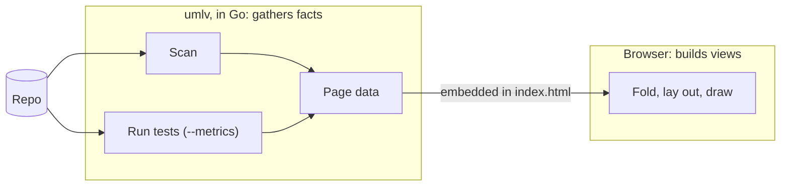

# uml-viewer-neo: design

`umlv` reads a code repository and writes one HTML page that shows its
structure: which parts exist, which use which, and how risky each one is to
change. You open the page in a browser, double-click into folders, and click
a box to see its functions and their scores.

A few words carry the rest of this doc:

- A **module** is the unit a language imports: a Go package, a TypeScript
  file, a Python file. Modules live in **folders**.
- A **box** is one module or folder at the level you are looking at. Folder
  names end in `/`.
- An **arrow** from one box to another means the first imports the second.
- A **lamp** on each box grades how risky its code is to change, from its
  CRAP score (see [Metrics](#metrics)). An unlit lamp means "not measured".
- A **card** is the side panel that opens when you click a box: its
  functions, their scores, and what it uses and is used by.

`umlv` replaces the uml-viewer-polyglot fork (`~/Documents/Repos/uml-viewer-polyglot`)
of unclebob's [uml-viewer](https://github.com/unclebob/uml-viewer). The ideas
come from there: folders as nested components, risk scores painted on the
diagram. The machinery changes: the fork needs Java and draws into a desktop
window with Quil, a Clojure graphics library, and its picture is hard to
read.

## Goals

Version 1 is done when it replaces the fork for everyday reading of Go,
TypeScript and Python repos:

- One Go binary. Nothing else to install beyond the scanned repo's own
  toolchain (`go`, `node` or `python3`) and, for `--metrics`, its own test
  tools.
- One self-contained HTML file per scan that works offline and can be sent
  to someone.
- Drill-down by folder, one arrow per pair of boxes, and a card for every
  box.
- `--metrics` runs the repo's tests with coverage and lights the lamps.
- Arrows can be switched off, and hovering one names its two ends, because
  arrow spaghetti was the fork's worst readability problem.
- A calm 1970s mission-control look (see [Look](#look)).
- `umlv` holds itself to its own numbers: run on this repo, every Go module
  is green.

**Not in version 1:** mutation testing, red rule-breaking arrows, proposals,
repos that mix languages, Rust, live rescanning. See [Later](#later).

## Two halves

The Go side **gathers facts**: the modules, their functions, what they
import, and every score, including each module's grade. The page **builds
views**: for the folder you are looking at, it folds deeper modules into
their folders, merges arrows, lays the boxes out and draws them.

Folding happens in the page because drill-down is interactive: the page
needs the whole tree to open any folder without asking anything else.
Grading happens in Go, because the thresholds must live in one language and
the self-check runs there. The page only has to pick the worst grade under a
folder, which needs no thresholds.

There is no server. A page opened from disk cannot read other files, so the
facts are embedded in the page itself. The one thing a server would add is
live rescanning; instead you re-run `umlv` and refresh, and the page keeps
your place.

## The page

The page shows one folder level at a time. Each module or folder at that
level is a box with its name, its lamp, and two badges: how many boxes it
uses and how many use it, counting partners inside and outside the current
folder. Arrows join the boxes that are both on screen. Libraries named in the
policy are drawn as ovals. A folder that is also a module (a Go package with
sub-packages, a TypeScript `index.ts`) is one box: its card shows the module,
and double-clicking opens the folder.

| Action | Result |
|---|---|
| Double-click a folder | Open it |
| Esc, or click the breadcrumb | Go up a level |
| Click a box | Highlight its arrows; open its card |
| Hover an arrow | Name the box it comes from and the box it points to |
| Hover a badge | List the boxes behind the count |
| Arrows switch | Hide or show arrows; boxes stay where they are |
| Scroll, drag, pinch | Zoom and pan |

Boxes do not list their functions; the card does. That keeps every box
small, so the layout stays compact and does not move when arrows are hidden.

A module's **card** shows its path, as a link that opens it in your editor;
its CRAP mean, spread and worst; and a table of its functions with CRAP, CC
and coverage. A folder's card shows its lamp, how many of its modules were
measured, and its children. Both list what the box uses and what uses it.

The header says when the repo was scanned and when coverage last ran. The
current folder and the arrows switch live in the URL fragment, so refreshing
after a re-scan keeps your place.

## Metrics

**CRAP** (Change Risk Anti-Patterns) measures how risky a function is to
change: `CC² × (1 − coverage)³ + CC`, where **CC** (cyclomatic complexity)
is 1 plus one for every branch point: `if`, conditional expression, loop,
`case`, `catch` or `except`, `&&`, `||`, `??`. A fully tested function
scores its CC; an untested complex one scores far higher.

**Coverage** counts only what runs inside a function's body. A `def` line,
or the `const f =` of a one-line arrow function, runs when the file is
imported and would credit a function nobody called; this is why the
scanners report where each body starts, down to the column. Two edge cases
the fork got wrong:

| Case | Treated as |
|---|---|
| The module's file is absent from the coverage report | Not measured, not 100% covered |
| The function has no statements to cover | Covered |

A module's functions are summarised by mean (μ), spread (σ, the standard
deviation) and worst (max). Its grade reads μ + σ, so one very bad function
darkens a module whose average looks fine.

| Lamp | μ + σ of the module's CRAP |
|---|---|
| Green | 8 or less |
| Amber | over 8, up to 12 |
| Red | over 12 |
| Unlit | no function measured |

The cut-offs come from the fork, which took them from unclebob's tool; we
revisit them once `umlv` has numbers of its own.

A folder's lamp shows the worst **measured** module under it, and is unlit
only when nothing under it was measured, so an unmeasured module never
passes for a bad one. The folder's card says how many of its modules were
measured ("6 of 9 measured"), so an unmeasured module cannot hide either.

`--metrics` runs the repo's own test tools (see [Languages](#languages)).
Without it, `umlv` reuses the coverage report from the last run if there is
one, and the header says how old it is.

## Decisions

| Decision | Choice | Why |
|---|---|---|
| Language | Go | One static binary; no JVM. |
| Output | One HTML file with the facts, code and styles inside | Works offline, survives being emailed, needs no server. |
| Layout | [ELK.js](https://github.com/kieler/elkjs) (layered), vendored | A mature layout and arrow-routing library replaces about 1,400 lines of hand-written layout in the fork. It is most of the page's size, about 1.5 MB. |
| Page code | Plain JavaScript files, bundled into the page by esbuild's Go API each time `umlv` runs | No npm and no generated files to go stale; the files stay importable by tests. Costs several MB of binary. |
| Drawing | The page's render functions return SVG and HTML as strings | Testable in Node without a browser. |
| Page tests | Node's built-in `node --test` | Node is already needed for TypeScript scans. |
| Policy file | TOML | Comments and hand editing; one small dependency. |
| Output folder | `.umlv/` in the scanned repo | One folder to ignore: the policy, `index.html`, raw reports. The fork's `.uml-viewer/` is left alone. |
| Fonts | The system's monospaced font | Nothing to embed or license; a fixed-width font also lets layout size boxes from character counts. |
| One mark per box | A single lamp (C) in version 1 | A permanently dark second lamp for mutation would read as broken; it arrives with mutation testing. |

## Contracts

Three boundaries are internal; the policy file is the contract with you.

### Scan facts: scanner to CLI

Every scanner produces the same JSON: the modules, their imports and their
functions. Nothing downstream knows which scanner produced it, which is what
makes a language pluggable. The facts must carry:

- **Two names per module:** its id, which imports point at (an import path
  in Go, a file path in TypeScript and Python), and its place in the folder
  tree, which can differ (`index.ts` stands for its directory; a leading
  `src/` is dropped).
- **Where every function is:** its file (a Go package spans several), its
  lines, and where its body starts, down to the column.
- **Imports resolved** to a project module, a library by its real name
  (`github.com/spf13/pflag`, `@scope/pkg`), or the standard library.
  Type-only imports count.
- **Methods and object-literal methods** as functions, named `Type.method`
  or `object.method`.
- **Notes** for anything the scanner left out, such as Python scripts
  outside every package, so the CLI can say so.

Tests, vendored code and build output are skipped.

### Coverage units: report reader to CRAP

Every test tool reports coverage differently: Go by blocks of statements,
istanbul by statement, coverage.py by line. Each language's reader turns its
report into the same units, each a span of a file with a weight and whether
it ran. CRAP is computed from units and function positions only, so it never
needs to know which tool ran.

### Page data: CLI to page

The CLI embeds one JSON document in the page: when the repo was scanned and
measured, and the scan facts with each function's scores and each module's
grade filled in. Policy is resolved before embedding (libraries are marked,
the editor becomes a link prefix), so the page knows nothing about policy.
One Go type owns this shape and `model.js` is its only reader. A Go test
writes it for each sample repo, and the page tests read that same file, so
the two languages cannot drift apart.

### Policy

`umlv` writes `.umlv/policy.toml` on the first scan and never overwrites it.

| Key | Meaning | Default |
|---|---|---|
| `libraries` | Outside libraries drawn as ovals | The 8 imported by the most modules |
| `editor` | Editor for source links: `vscode` or `cursor` | `vscode` |
| `coverage.command`, `coverage.report` | Replace the language's test command and report path | See [Languages](#languages) |

## Languages

Everything `umlv` knows about one language lives in its own package: how to
recognise it, how to scan it, and how to run and read its coverage, along
with its scanner script, its sample repo and its captured reports. A
language can be read, tested and removed on its own; adding one means adding
a package and naming it in `cmd/umlv`, nothing else.

| Language | Recognised by | A module is | Scanned by | Coverage |
|---|---|---|---|---|
| Go | `go.mod` | a package | `go list` and `go/parser`, inside the binary | `go test -coverprofile` |
| TypeScript, JavaScript | `tsconfig.json`, `package.json` | a file | TypeScript's own parser, through `node` | vitest or jest, istanbul JSON |
| Python | `pyproject.toml`, `setup.py` | a file | Python's `ast`, through `python3` | `python3 -m pytest --cov`, coverage.py JSON |

The TypeScript and Python scanners are scripts carried inside the binary and
fed to `node` or `python3` directly; they are never written to disk. The
TypeScript scanner uses the repo's own `typescript`, so a repo without
`node_modules` needs `npm install` first.

## Look

A 1970s mission-control console, tuned for long reading rather than
nostalgia: warm, dim and quiet, with no glow or scanlines to tire the eyes.
Boxes are plain panels and the lamp alone carries the grade, because the
fork's whole-box colour fills made its canvas murky. Colour is never the
only signal: the lamp states differ in brightness, an unlit lamp is a dark
socket with a faint ring, and hovering a lamp shows its number.

| Token | Role |
|---|---|
| Charcoal | Page background |
| Panel | Box and card fill, one step lighter |
| Rule | Thin lines: box borders, arrows, table rules |
| Cream | Body text, box names |
| Amber | Labels, headings, the selected box |
| Lamp green, amber, red | Grades |
| Lamp unlit | Not measured |

## Code organisation

| Package | Job | Depends on |
|---|---|---|
| `cmd/umlv` | Flags, the list of languages, wiring, all printing and exit codes | everything |
| `internal/facts` | The shared types: modules, functions, scores, grades, page data | nothing |
| `internal/lang` | What every language provides (recognise, scan, coverage command, report reader), and the code that runs a scanner script | `facts`, `metrics` |
| `internal/lang/golang` | The Go scanner, inside the binary; the cover-profile reader | `lang`, `facts`, `metrics` |
| `internal/lang/typescript` | `tsscan.js`, embedded; the istanbul reader | `lang`, `facts`, `metrics` |
| `internal/lang/python` | `pyscan.py`, embedded; the coverage.py reader | `lang`, `facts`, `metrics` |
| `internal/metrics` | Coverage units, running a command, CRAP, module stats and grades | `facts` |
| `internal/policy` | Read, default, write and apply the policy | `facts` |
| `internal/page` | Build the page data, bundle the page code, write `index.html` | `facts`, `web` |
| `web` | The page's files, embedded for `page` | nothing |

Packages return errors and warnings and never print or exit; `cmd/umlv`
decides what to tell you. A run with `--metrics` ends by printing a one-line
grade summary, which is also how the self-check is read.

The page's code follows the same one-way rule:

| File | Job | Depends on |
|---|---|---|
| `model.js` | Page data and a folder in; boxes, merged arrows, badge counts and folder lamps out | nothing |
| `layout.js` | Boxes and arrows in; positions and arrow routes out, via ELK.js (asynchronous) | ELK.js |
| `render.js` | Positions in; SVG for the diagram and HTML for the card out | nothing |
| `app.js` | Events, state and the URL fragment; calls the others | all of the above |

## Errors

Stop when the picture would be wrong; carry on with unlit lamps when it
would only be incomplete.

| Situation | Behaviour |
|---|---|
| The repo's toolchain (`go`, `node`, `python3`) is missing | Stop; name the tool and how to install it |
| No language recognised | Stop; suggest `--lang` |
| A TypeScript repo has no `typescript` installed | Stop; suggest `npm install` |
| A scanner fails | Stop; show its error output |
| `policy.toml` does not parse | Stop; give the file and line |
| The test run fails | Warn; use whatever report it wrote |
| The coverage tool is not installed | Warn; name the package; continue unlit |

## Testing

Red/green TDD throughout. Each language package tests its scanner against a
small sample repo and its report reader against real reports captured from
the tool, both kept in its own `testdata/`. CRAP, stats and grading are table-driven, including both
coverage edge cases. The page's `model.js` and `render.js` run under
`node --test` against the page data the Go tests write for the sample repos.
An end-to-end test scans each sample repo and checks that the HTML carries
its data. The look is checked by eye, from a browser screenshot of a real
repo.

## Later

| Feature | Notes |
|---|---|
| Mutation testing (`--mutate`) | gremlins, mutmut, Stryker; adds the M lamp |
| Rule-breaking arrows in red | The policy ranks folders by level; Go marks each import that points the wrong way, and merged arrows keep the mark if any import under them has it |
| Proposals | Alternative groupings of folders, viewed as their own diagram; `model.js` keeps building the folder tree separate from viewing one level of it, so a proposal is just another tree |
| Mixed-language repos | Run several languages over one repo and combine their modules; needed to scan this repo's own `web/` |
| Python class edges, Rust | Inheritance and Protocol/ABC edges; a Rust scanner |
| Live rescan | An optional small server, if refreshing proves annoying |
