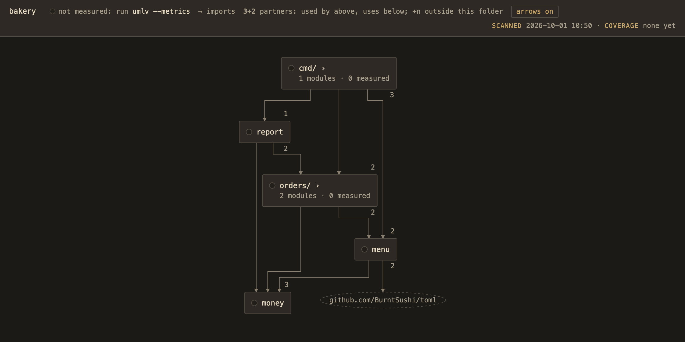
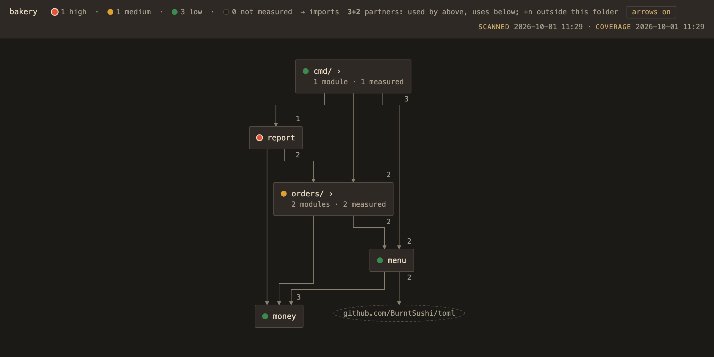
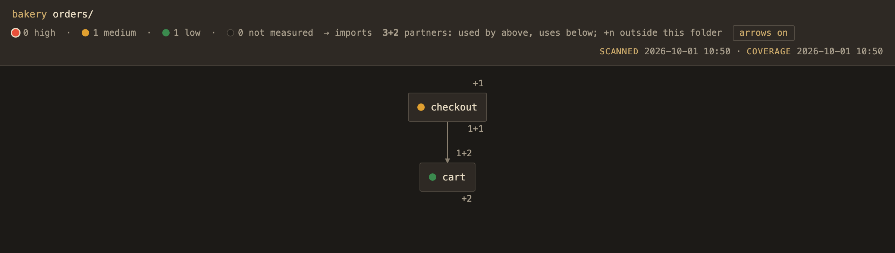
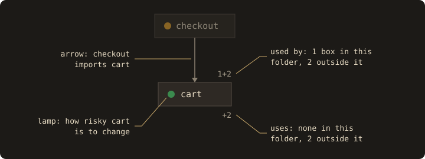
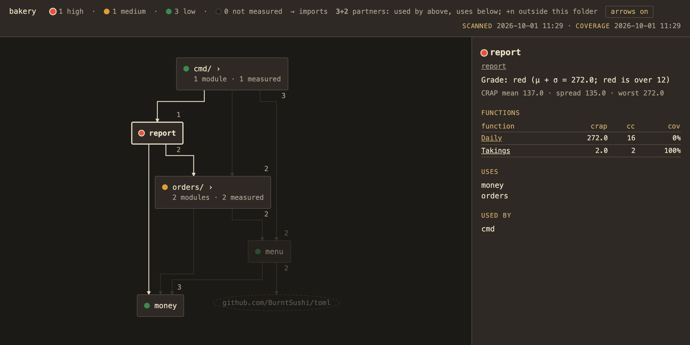

# Reading the page

This walks through one small example, a pretend bakery app in
[`examples/bakery`](../examples/bakery), so you know what you're looking at the first time umlv
opens on your own code. It takes about five minutes.

## Boxes and folders

Run `umlv examples/bakery` and you get this:

A box is either a folder or a module. In Go, a module is a package; in TypeScript or Python it's just a file. 
`report`, `menu` and `money` are modules.

Boxes that are folders have names that end in `/ ›`, like `orders/ ›`, is a folder. These are
just placeholders for everything inside of it so that the page doesn't immediately overwhelm you
with a wall of boxes. You can double-click the box to navigate into the folder.

The "lamps" in this diagram are dark; this just means that umlv hasn't run any tests yet (more on 
this later in the Lamps section).

## Arrows

An arrow from A to B means A imports B, so A depends on B. `report → money` means the report code
uses the money code. An arrow between two folder boxes means some module in the first folder
imports some module in the second folder.

In terms of page orientation, dependencies are placed below the code that uses them so you should
read from top to bottom. `cmd/`, where the program starts, is at the top, and `money`, which 
everything uses, is at the bottom. An arrow pointing upward is noteworthy because it usually
means that there's a circular dependency.

The dashed oval is a library from outside the repo, here the TOML parser `menu` uses to read the
menu file. The standard library isn't drawn, and you can pick which outside libraries appear in
`.umlv/policy.toml`.

## Lamps

When you run `umlv --metrics examples/bakery`. umlv runs the project's own tests with coverage turned
on, then scores the code. Later runs reuse that report, so you only need `--metrics` again when
you want fresh numbers. The header shows when the code was scanned and when coverage was last
measured, so you can tell when the lamps are out of date.

Green is low risk, amber is medium and red is high. Red lamps also have a light ring, so you can
tell them apart without relying on colour.

Each function gets "CRAP" score. "CRAP" is calculated from two things: how complicated the function 
is, and how much of it the tests actually cover. The formula is in the [design doc](design/architecture.md#metrics).

In the bakery example:

- `main` has 2 paths through it and no tests. It scores 6, green. Simple code is low risk even
  without tests.
- `Discount` in `orders/checkout` has 10 paths, and the tests run 92% of it. It scores 10.1,
  amber. Tests can't bring a score below the number of paths, so the only way to green is to
  split the function up.
- `Daily` in `report` has 16 paths and no tests at all. It scores 272, red.

A module's lamp comes from its functions' scores: their average plus how spread out they are, so
one bad function can't hide behind the average. The module is green if that comes to 8 or less,
amber up to 12, and red above 12 (you can change the thresholds if you disagree - this is entirely
a matter of opinion). `report` has a small tested `Takings` function that scores 2 but the module 
is red anyway because of `Daily`.

A folder's lamp shows the _**worst**_ module inside it (this project has a conservative disposition). 
`orders/` is amber because of `checkout`, even though `cart` is green.

If a lamp stays dark after `--metrics`, the coverage report didn't include that code, probably because
there aren't any tests that load it.

## The numbers on a box

The small numbers at the corners of a box count the boxes it's connected to. The number on top
counts the boxes that use it. The number underneath counts the boxes it uses. The key in the
header calls these partners.

These numbers belong to the box, not to the arrows that can sometimes be placed next to them.
In the screenshot above, `cmd/` has a 3 underneath because it uses three boxes: `report`, `orders/` 
and `menu`. The 1 above `report` is a separate count: one box, `cmd/`, uses `report`.

Inside a folder you'll also see a `+`. Here's `orders/` opened up:

`cart` has `1+2` on top: one box in this folder uses it (`checkout`), and so do two boxes outside
the folder (`report` and `cmd/`). Underneath, `+2` means it uses two boxes outside, `menu` and
`money`, and none in here. Hover over any number to see the boxes it's counting.

## Clicking a box

Click `report` and a card opens on the right:

The card starts with the module's grade and the number behind it (μ + σ is the average plus the
spread). Below that it lists each function with its score (`crap`), its complexity (`cc`, roughly
the number of paths) and how much of it the tests run (`cov`). The card shows why `report` is
red: `Daily` has 16 paths and no test touches it. The path under the name and each function name
open the code in VS Code, or in whichever editor you set in `.umlv/policy.toml`.

## Getting around

- Click a box to select it. Click empty space to clear it.
- Double-click a folder, or select it and press Enter, to go inside.
- Escape clears the selection. With nothing selected, it takes you up a folder. The names at the
  top left (`bakery orders/`) take you back up too.
- Scroll to zoom, drag to pan, and press 0 to fit the diagram back on screen.
- The `arrows on` button hides the arrows when a view gets busy.
- The address bar keeps the folder you're in and the box you've selected, so you can bookmark a
  view or send it to someone.
